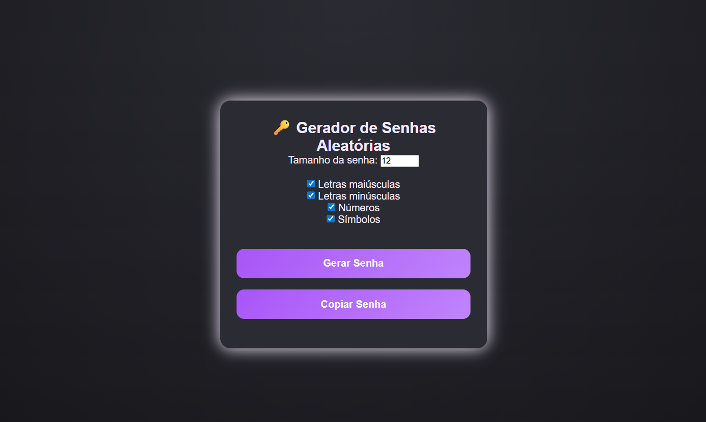

# 🔑 Gerador de Senhas Aleatórias

Um projeto simples e funcional desenvolvido em **HTML, CSS e JavaScript**, que permite gerar **senhas aleatórias personalizáveis**, escolhendo tamanho e tipos de caracteres.


## 📸 Preview




## ✨ Funcionalidades

* Definir o **tamanho da senha**
* Selecionar os tipos de caracteres:

  * Letras maiúsculas
  * Letras minúsculas
  * Números
  * Símbolos
* Gerar senha aleatória instantaneamente
* Copiar senha para a área de transferência
* Interface responsiva e modo escuro


## 🛠️ Tecnologias Utilizadas

* **HTML5** – Estrutura da aplicação
* **CSS3** – Estilização, tema escuro e responsividade
* **JavaScript (Vanilla JS)** – Lógica, eventos e DOM

---

## 📂 Estrutura do Projeto

```text
gerador-senha/
│
├── index.html      # Estrutura da aplicação
├── style.css       # Estilos e layout
└── index.js        # Lógica de geração da senha
```
## 📄 Licença

Este projeto é de uso livre para **estudo, aprendizado e prática**.


